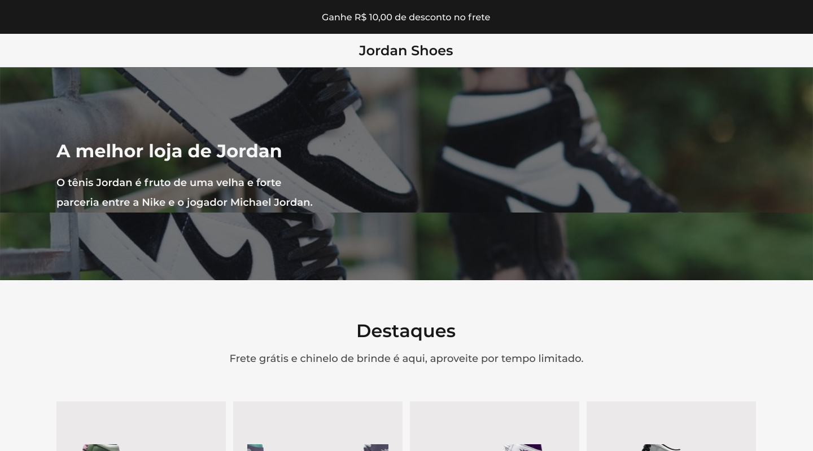
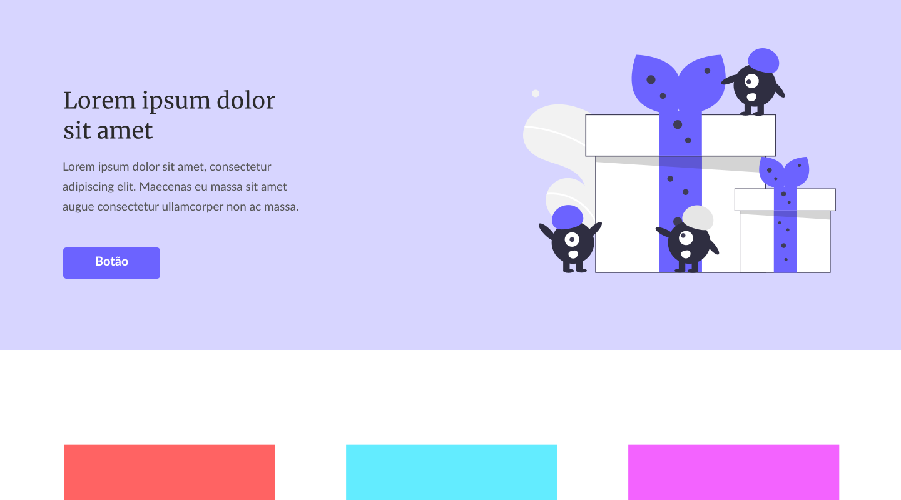

<h2 align="center">
  Desafios Codelândia
</h2>

  Objetivo dos desafios é ajudá-lo a melhorar suas habilidades fazendo mini projetos semanais.

  <a href="https://discord.com/invite/QevDJqCzaY">Entre na nossa comunidade!</a>

---

## 🖖 Apresentação

Olá pessoal, tudo bem?

Os desafios vão ser lançados todos os finais de semanas!

Todos os desafios são para nível JÚNIOR, mas com o tempo vamos ir aprofundando cada vez mais.

Os desafios serão feitos no Figma onde qualquer pessoa pode acessá-lo e até deslocá-lo para editá-lo.

---

## 🎯 Índice de desafios

* [Desafio 01 - Blog](#id01)
* [Desafio 02 - Jordan Shoes](#id02)
* [Desafio 03 - One page](#id03)

---

### **Desafio 01 - Blog** 

Link do desafio no Figma: [Clique aqui](https://www.figma.com/file/Yb9IBH56g7T1hdIyZ3BMNO/Codel%C3%A2ndia-Desafios?node-id=0%3A1)

Material de apoio: [Clique aqui](https://github.com/iuricode/desafios-codelandia/blob/main/material-de-apoio/material-de-apoio-desafio01.zip)

---

### **Desafio 02 - Jordan Shoes** 

Link do desafio no Figma: [Clique aqui](https://www.figma.com/file/Yb9IBH56g7T1hdIyZ3BMNO/Codel%C3%A2ndia-Desafios?node-id=1883%3A2)

Material de apoio: [Clique aqui](https://github.com/iuricode/desafios-codelandia/blob/main/material-de-apoio/material-de-apoio-desafio02.zip)

---

### **Desafio 03 - One page** 

Link do desafio no Figma: [Clique aqui](https://www.figma.com/file/Yb9IBH56g7T1hdIyZ3BMNO/Desafios-Codel%C3%A2ndia?node-id=3725%3A2)

Material de apoio: [Clique aqui](https://github.com/iuricode/desafios-codelandia/blob/main/material-de-apoio/material-de-apoio-desafio03.zip)

---

## 📝 Licença

Esse projeto está sob a licença MIT. Veja o arquivo [LICENSE](LICENSE) para mais detalhes.

---

Feito com 💜 by **Codelândia** [Entre na nossa comunidade!](https://discord.com/invite/QevDJqCzaY)
